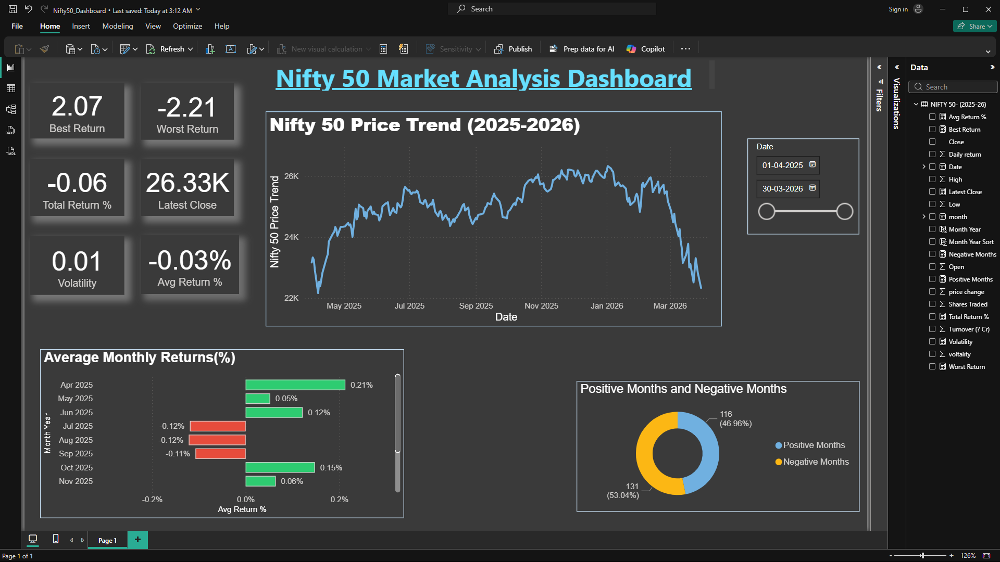

📊 Nifty 50 Market Analysis Dashboard (Power BI)

This project analyzes Nifty 50 market performance (2025–2026) using Power BI. It focuses on identifying trends, monthly returns, and volatility through interactive dashboards.

## 🔍 What I did

* Cleaned and transformed stock market data
* Created calculated measures like:

  * Average Return %
  * Total Return %
  * Volatility
* Built interactive visuals to understand market behavior

## 📈 Key Insights

* Identified months with positive and negative returns
* Observed overall market trend using price movement
* Compared performance using KPIs like best and worst return
* The market showed increased negative returns towards early 2026, indicating a potential downturn phase

## 🛠 Tools Used

* Power BI
* Excel (for data preprocessing)
* DAX (for calculations)
* SQL (for initial data preparation)

## 📊 Dashboard Preview

## 📌 Features

* Date slicer for dynamic filtering
* Conditional formatting (green = positive, red = negative)
* KPI cards for quick insights
* Monthly performance breakdown

---

This project helped me understand how to convert raw financial data into meaningful insights using Power BI.
